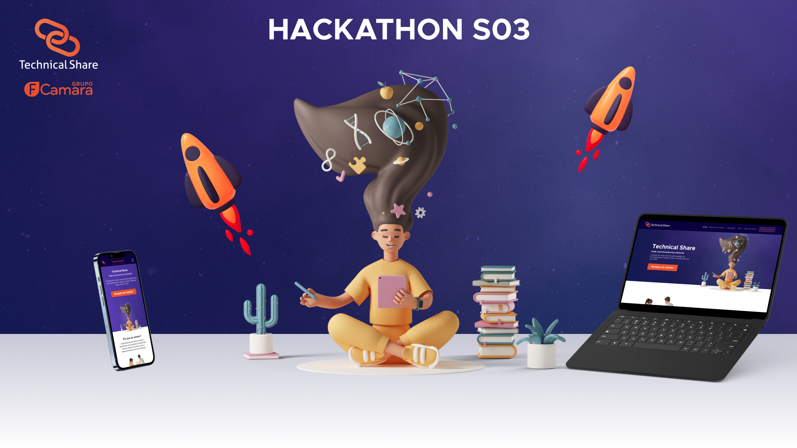

<h1 align="center"> :stars: Technical Share - Squad 31 :stars: </h1>



<p align="center">
	<a href="#sobre">Sobre</a> • 
	<a href="#avaliação">Avaliação</a> • 
	<a href="#funcionalidade">Funcionalidade</a> • 
	<a href="#tecnologias">Tecnologias</a> • 
	<a href="#obter">Obter</a> • 
	<a href="#extra">Extras</a> • 
	<a href="#squad">Participantes</a>
</p>

<hr>

<h2 id="sobre"> :memo: Sobre</h2>

- Projeto criado pelo Squad 31 durante o Hackathon do programa de formação do Grupo FCamara (S03 2022)
- Este projeto teve o propósito de criar uma ferramenta capaz de conectar mentorados com seus respectivos mentores.
<h3>Como:</h3>
<p>Na página principal, o usuário irá visualizar alguns depoimentos de usuários que já receberam uma mentoria. O usuário pode buscar por um mentor através de uma habilidade escolhida, ou pelo nome do próprio mentor.
O usuário também pode se cadastrar para dar mentorias nas áreas em que se sinta confortável.
Será possível realizar um agendamento pela parte do mentorado, o mentor receberá um E-mail informando a intenção de agendamento. A partir daí ambos os usuários poderão se conectar para dar andamento à mentoria.</p>

<h2 id="avaliação"> :heavy_check_mark: Avaliação</h2>

- Deverá ser uma aplicação web responsiva;
- Deverá ser entregue no mínimo 3 telas do projeto, sendo protótipo e desenvolvimento;
- Vocês são livres para utilizar qualquer tecnologia que tenham mais afinidade;
- Sejam criativos! Pensem fora da caixinha, inovem! Nós demos o problema, e vocês, como consultores, deverão trazer a melhor solução ;)
- A entrega é um MVP, um mínimo produto viável, ou seja, faça aquilo que entregará valor ao cliente e usuário final!

<h2 id="funcionalidade"> :gear: Funcionalidade </h2>

<p>Na estilização do front-end dividimos partes do arquivo html em componentes para o React, aplicando CSS puro para cada respectivo componente, criando assim um layout mais acessível.</p>

<h2 id="tecnologias"> :robot: Tecnologias </h2>


<a href="https://developer.mozilla.org/en-US/docs/Glossary/HTML" target="_blank"></a> <a href="https://developer.mozilla.org/en-US/docs/Web/CSS"></a> </a> <a href="https://www.javascript.com/"></a> <a href="https://pt-br.reactjs.org/"></a>

<h2 id="obter"> :card_file_box: Como Obter o Projeto</h2>

```bash
# Clone o repositório
git clone https://github.com/Hackathon-Fcamara/technical-share.git

# Entre na pasta do projeto
cd technical-share/front-end

# Na pasta front-end execute o comando:
yarn install
ou
npm install

# E rode a aplicação através do seguinte comando:
yarn start
ou
npm start
```

<h2 id="extra"> :paperclip: Extras </h2>

- :paintbrush: Link do nosso <a href="https://www.figma.com/file/cm19a1XPH4gpuMTbM1nFoN/Technical-Share---UI?node-id=10%3A2">Figma</a>;
- :clipboard: Nossa tabela <a href="https://certain-red-016.notion.site/Sala-de-Controle-Squad-31-d67c6c99e26f47399aff2116ab1ea82b">Notion</a>;
- :movie_camera: Video do <a href="https://youtu.be/s6xO_Rq9eMw">Pitch</a>;
- :scroll: E <a href="https://www.behance.net/gallery/141699911/FCamara-Hackathon-S03-Technical-Share">Behance</a>.


<h2 id="squad"> :sparkles: Squad 31 </h2>

| :camera_flash:                                              | Nome              | Contatos                                                                                                                            |
| ----------------------------------------------------------- | ----------------- | ----------------------------------------------------------------------------------------------------------------------------------- |
| <br>_Dev_           | Brian Rocha       | <a href="https://www.linkedin.com/in/brian-rocha-897220237">Linkedin</a><br><a href="https://github.com/BobtheCoder-jpg">Github</a>|
| <br>_Dev_        | Leonardo Teixeira |                                                                                         <a href="https://www.linkedin.com/in/leotx/ ">Linkedin</a><br><a href="https://github.com/leottx">Github</a>                                               |
| <br>_UX Designer_ | Matheus Santos    | <a href="https://www.linkedin.com/in/matheussantos081194/">Linkedin</a><br><a href="https://www.behance.net/mathsnts">Behance</a>    |                                                                                                                                     |
| <br>_UX Designer_ | Monique Vaz       | <a href="https://www.linkedin.com/in/monique-vaz-081b8016a">Linkedin</a><br><a href="https://www.behance.net/moniquecardoso1">Behance</a>                                                            |
| <br>_Dev_        | Rafael Sampaio        | <a href="https://www.linkedin.com/in/rafael-sampaio-de-oliveira-49b317210/">Linkedin</a><br><a href="https://github.com/Samppaio">Github</a>                                                                                                                                    |
| <br>_UX Designer_ | Vanessa Almeida   | <a href="https://www.linkedin.com/in/vanessaalmartins/">Linkedin</a>                                                                                                                                    |
| <br>_Dev_          | Victor Martins    | <a href="https://www.linkedin.com/in/victorm-reis/">Linkedin</a><br><a href="https://github.com/victormreis">Github</a>              |

<hr>

<h4>Feito com açúcar, tempero e tudo que há de bom pelo Squad 31!!! :orange_heart:</h4>
<p>ᴱ ᵘᵐ ᵖᵒᵘᶜᵒ ᵈᵉ ᵉˡᵉᵐᵉⁿᵗᵒ ˣ</p>
